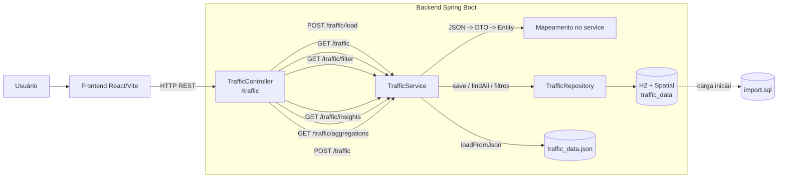

# Smart Traffic Flow

Aplicação full stack para simulação, visualização e consulta de dados de tráfego urbano. O projeto combina um backend em Spring Boot com um frontend em React/Vite, usando um dataset simulado pela equipe para explorar padrões básicos de mobilidade urbana.

## Visão Geral

O estado atual do projeto inclui:

- backend REST em Spring Boot para carga, persistência e consulta de dados de tráfego
- endpoint de insights para o MVP em `GET /traffic/insights`
- endpoint de agregações para o MVP em `GET /traffic/aggregations`
- persistência em H2 em memória no backend
- carga inicial automática via `import.sql`
- testes de integração básicos para os principais endpoints do MVP
- documentação modular separada por API, dados e frontend

Limitações atuais conhecidas:

- `POST /traffic/load` depende de `traffic_data.json` no classpath e esse arquivo ainda não está em `backend/src/main/resources`
- o frontend ainda está em fase inicial e não mostra integração explícita com a API nas telas atuais
- o mapa com Leaflet permanece como melhoria futura e não faz parte do fluxo principal do MVP
- ainda não há autenticação nem uma suíte completa de testes além da cobertura básica do backend

## Stack

### Backend

- Java 21
- Spring Boot 3.5.11
- Spring Web
- Spring Data JPA
- Spring Validation
- H2 Database
- Hibernate Spatial
- H2GIS
- Lombok
- Maven Wrapper

### Frontend

- React 19
- Vite 8
- ESLint

## Documentação

O repositório segue uma estrutura de documentação modular:

- [API](docs/api.md)
- [Dados](docs/dados.md)
- [Frontend](docs/frontend.md)

## Arquitetura



## Estrutura do Projeto

```text
.
|-- backend/
|   |-- pom.xml
|   `-- src/main/
|       |-- java/br/com/smartTrafficFlow/Smart_Traffic_Flow/
|       |   |-- controller/
|       |   |-- dto/
|       |   |-- entity/
|       |   |-- enums/
|       |   |-- repository/
|       |   `-- service/
|       `-- resources/
|           |-- application.properties
|           `-- import.sql
|-- docs/
|   |-- api.md
|   |-- dados.md
|   `-- frontend.md
|-- frontend/
|   |-- package.json
|   |-- vite.config.js
|   `-- src/
|       |-- App.jsx
|       `-- pages/home/Home.jsx
|-- LICENSE
|-- README.md
`-- README_DADOS.md
```

## Como Executar

### Backend

No diretório `backend`:

```bash
./mvnw spring-boot:run
```

No Windows PowerShell:

```powershell
.\mvnw.cmd spring-boot:run
```

Backend disponível por padrão em:

- API: `http://localhost:8080`
- Swagger UI: `http://localhost:8080/swagger-ui/index.html`
- OpenAPI JSON: `http://localhost:8080/v3/api-docs`
- Console H2: `http://localhost:8080/h2-console`

### Frontend

No diretório `frontend`:

```bash
npm install
npm run dev
```

Frontend Vite disponível por padrão em:

- `http://localhost:5173`

## Status do MVP

Entregas já implementadas no backend:

- `GET /traffic`
- `GET /traffic/filter`
- `POST /traffic`
- `POST /traffic/load`
- `GET /traffic/insights`
- `GET /traffic/aggregations`
- payload simplificado com `lat` e `lng` para consumo no frontend
- testes de integração cobrindo endpoints principais do MVP

## Roadmap de Documentação

Sempre que o projeto evoluir, atualizar pelo menos:

1. `README.md` para status geral e arquitetura
2. `docs/api.md` para endpoints, payloads e respostas
3. `docs/dados.md` para massa de dados e contrato
4. `docs/frontend.md` para telas, stack e integração com a API

## Referências do Código

- [TrafficController.java](backend/src/main/java/br/com/smartTrafficFlow/Smart_Traffic_Flow/controller/TrafficController.java)
- [TrafficService.java](backend/src/main/java/br/com/smartTrafficFlow/Smart_Traffic_Flow/service/TrafficService.java)
- [TrafficData.java](backend/src/main/java/br/com/smartTrafficFlow/Smart_Traffic_Flow/entity/TrafficData.java)
- [TrafficResponse.java](backend/src/main/java/br/com/smartTrafficFlow/Smart_Traffic_Flow/dto/TrafficResponse.java)
- [TrafficCreateRequest.java](backend/src/main/java/br/com/smartTrafficFlow/Smart_Traffic_Flow/dto/TrafficCreateRequest.java)
- [TrafficControllerIntegrationTest.java](backend/src/test/java/br/com/smartTrafficFlow/Smart_Traffic_Flow/controller/TrafficControllerIntegrationTest.java)
- [TrafficAggregationTest.java](backend/src/test/java/br/com/smartTrafficFlow/Smart_Traffic_Flow/integration/TrafficAggregationTest.java)
- [Home.jsx](frontend/src/pages/home/Home.jsx)
- [package.json](frontend/package.json)

## Licença

Este projeto está licenciado sob a MIT License.

Consulte [LICENSE](LICENSE).
