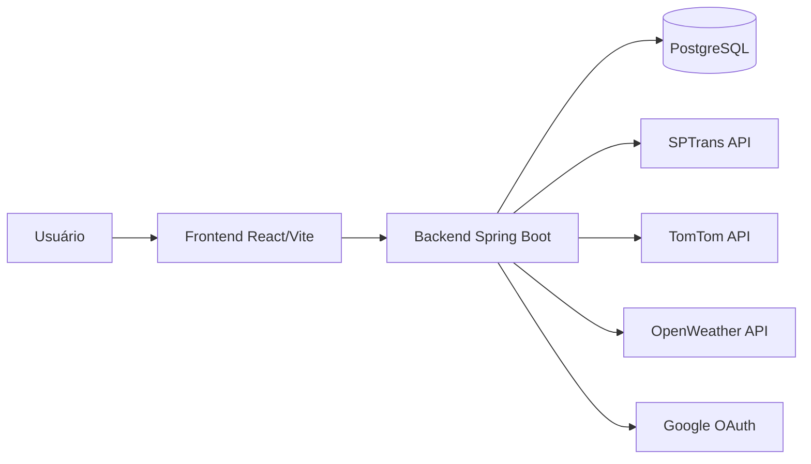

# Smart Traffic Flow

Aplicação full stack para observabilidade e análise de mobilidade urbana, com backend em Spring Boot, frontend em React/Vite e integrações externas (SPTrans, TomTom, OpenWeather e Google OAuth).

## Estado Atual (15/04/2026)

- Branch `dev` local sincronizada com `origin/dev`
- Backend com autenticação JWT ativa
- Persistência principal em PostgreSQL
- Endpoints de tráfego, autenticação, transporte, GTFS, clima e analytics
- Frontend funcional com Home/Login e componentes de visualização, com integração parcial com a API

## Stack

### Backend

- Java 21
- Spring Boot 3.5.11
- Spring Web, WebFlux, Validation, Data JPA, Security, Actuator
- OpenAPI/Swagger (`springdoc-openapi`)
- PostgreSQL + Flyway
- JTS + Hibernate Spatial
- JWT (`jjwt`)
- OAuth2 Client (Google)

### Frontend

- React 19
- Vite 8
- ESLint
- Leaflet + React-Leaflet

### Microservice (complementar)

- Python (pasta `microservice/`) para serviços auxiliares de roteamento, GTFS e analytics

## Documentação

- [API](docs/api.md)
- [Dados](docs/dados.md)
- [Frontend](docs/frontend.md)

## Arquitetura (alto nível)



## Estrutura do Projeto

```text
.
|-- backend/
|-- frontend/
|-- microservice/
|-- docs/
|   |-- api.md
|   |-- dados.md
|   `-- frontend.md
|-- README.md
`-- README_DADOS.md
```

## Como Executar

### 1) Backend

No diretório `backend`:

```powershell
.\mvnw.cmd spring-boot:run
```

ou

```bash
./mvnw spring-boot:run
```

Backend local:

- API: `http://localhost:8080`
- Swagger UI: `http://localhost:8080/swagger-ui/index.html`
- OpenAPI JSON: `http://localhost:8080/v3/api-docs`

### 2) Frontend

No diretório `frontend`:

```bash
npm install
npm run dev
```

Frontend local:

- `http://localhost:5173`

## Variáveis de Ambiente (backend)

Principais chaves usadas pelo backend:

- `JWT_SECRET`
- `GOOGLE_CLIENT_ID`
- `GOOGLE_CLIENT_SECRET`
- `SPTRANS_TOKEN`
- `TOMTOM_API_KEY`
- `OPENWEATHER_API_KEY`
- `SERPER_API_KEY`

Diretrizes:

- manter `.env.example` sem segredos reais
- não versionar credenciais/tokens no repositório

## Endpoints Principais (visão geral)

- `POST /auth/register`
- `POST /auth/login`
- `POST /auth/google`
- `GET /traffic`
- `GET /traffic/filter`
- `GET /traffic/insights`
- `GET /traffic/dashboard`
- `GET /traffic/traffic-volume`
- `GET /traffic/traffic-volume-area`
- `GET /api/transporte/*`
- `GET /api/gtfs/*`
- `GET /api/analytics/crowd-flow`
- `GET /api/test/clima`

Detalhes completos em [docs/api.md](docs/api.md).

## Testes

Suites de teste presentes em `backend/src/test`:

- `TrafficControllerIntegrationTest`
- `TrafficAggregationTest`
- `SmartTrafficFlowApplicationTests`

## Licença

Este projeto está licenciado sob MIT. Veja [LICENSE](LICENSE).
