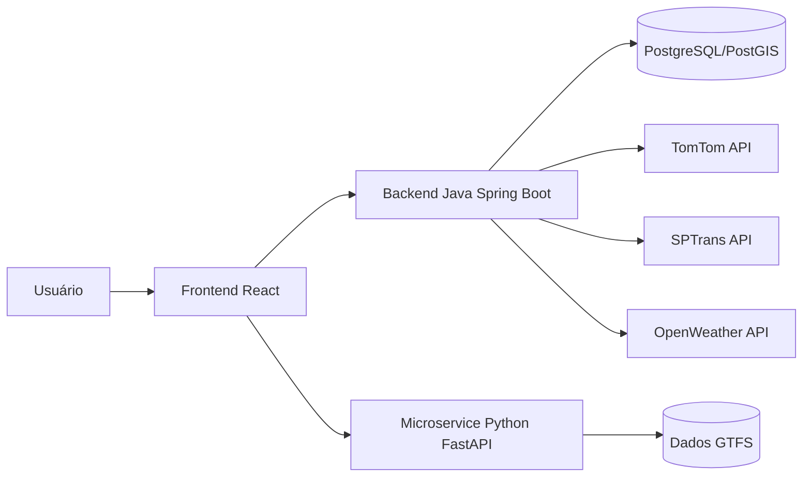

# Smart Traffic Flow

Plataforma full stack para monitoramento e análise de mobilidade urbana, com backend Java, microservice Python e frontend React.

## Estado do Projeto

- Branch de entrega: `main`
- Backend principal em `backend/` (Spring Boot + PostgreSQL)
- Frontend ativo em `SmartTrafficFlow/smartTrafficFlow`
- Microservice de apoio em `microservice/` (GTFS e analytics)
- Pasta `frontend/` legado removida da `main`

## Arquitetura (Visão Geral)



## Stack

### Backend (`backend/`)

- Java 21
- Spring Boot 3.5.11
- Spring Web, Security, Validation, Data JPA, WebFlux, Actuator
- OpenAPI/Swagger (`springdoc-openapi`)
- PostgreSQL + Flyway
- Hibernate Spatial + JTS
- JWT (`jjwt`)
- OAuth2 Client (Google)

### Frontend (`SmartTrafficFlow/smartTrafficFlow`)

- React 18 + Vite 8
- Tailwind CSS 4
- Axios
- React Router
- Recharts
- Leaflet / React-Leaflet

### Microservice (`microservice/`)

- Python
- FastAPI
- Pandas

## Documentação

- [API](docs/api.md)
- [Dados](docs/dados.md)
- [Frontend](docs/frontend.md)

## Estrutura do Projeto

```text
.
|-- backend/
|-- microservice/
|-- SmartTrafficFlow/
|   `-- smartTrafficFlow/
|-- docs/
|   |-- api.md
|   |-- dados.md
|   `-- frontend.md
`-- README.md
```

## Pré-requisitos

- Java 21
- Maven Wrapper (já incluso em `backend/`)
- Python 3.10+
- Node.js 18+
- Docker + Docker Compose (opcional, recomendado para avaliação rápida)

## Como Executar

### Opção A: Ambiente completo com Docker Compose

Na raiz do projeto:

```bash
docker compose up --build
```

Serviços:

- Frontend: `http://localhost:5173`
- Backend Java: `http://localhost:8080`
- Swagger Java: `http://localhost:8080/swagger-ui/index.html`
- Microservice Python: `http://localhost:8000`
- PostgreSQL: `localhost:5432`

### Opção B: Execução local por serviço

1. Backend:

```powershell
cd backend
.\mvnw.cmd spring-boot:run
```

2. Microservice:

```bash
cd microservice
pip install -r requirements.txt
uvicorn main:app --reload --port 8000
```

3. Frontend:

```bash
cd SmartTrafficFlow/smartTrafficFlow
npm install
npm run dev
```

## Variáveis de Ambiente

As variáveis abaixo são usadas no backend Java e no compose:

- `SPRING_DATASOURCE_URL`
- `SPRING_DATASOURCE_USERNAME`
- `SPRING_DATASOURCE_PASSWORD`
- `JWT_SECRET`
- `GOOGLE_CLIENT_ID`
- `GOOGLE_CLIENT_SECRET`
- `SPTRANS_TOKEN`
- `SPTRANS_API_URL`
- `OPENWEATHER_API_KEY`
- `TOMTOM_API_KEY`
- `API_TOMTOM_BASE_URL`
- `SERPER_API_KEY`

Observação:

- `SPTRANS_API_URL` mapeia para `sptrans.api.url`.
- `API_TOMTOM_BASE_URL` mapeia para `api.tomtom.base-url`.
- No ambiente Docker, a URL do banco já é injetada pelo `docker-compose.yml`.

## Endpoints Principais (resumo)

- `POST /auth/register`
- `POST /auth/login`
- `POST /auth/google`
- `GET /traffic`
- `GET /traffic/filter`
- `GET /traffic/insights`
- `GET /traffic/dashboard`
- `GET /traffic/traffic-volume`
- `GET /traffic/traffic-volume-area`
- `GET /api/transporte/*`
- `GET /api/gtfs/*`
- `GET /api/analytics/crowd-flow`
- `GET /api/test/clima*`

Detalhamento completo em [docs/api.md](docs/api.md).

## Testes Automatizados

No backend (`backend/src/test`):

- `TrafficControllerIntegrationTest`
- `TrafficAggregationTest`
- `SmartTrafficFlowApplicationTests`

## Licença

Projeto sob licença MIT. Consulte [LICENSE](LICENSE).
