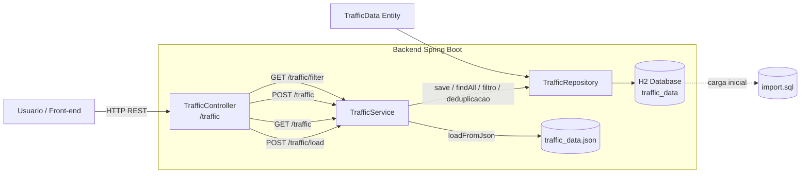

# Smart Traffic Flow

Backend REST para simulacao, carga e consulta de dados de trafego urbano. O projeto esta sendo construído em Spring Boot e foi organizado para crescer de forma previsivel, com documentacao separada por dominio e atualizavel ao longo das proximas sprints.

## Visao Geral

O estado atual da aplicacao inclui:

- API REST com consulta, filtro e criacao de registros de trafego
- persistencia em H2 em memoria
- carga inicial automatica via `import.sql`
- organizacao em camadas: `controller`, `service`, `repository` e `entity`
- console H2 habilitado para inspecao local

Limitacoes atuais conhecidas:

- `POST /traffic/load` depende de `traffic_data.json` no classpath, mas esse arquivo ainda nao esta em `backend/src/main/resources`
- ainda nao ha validacao de payload, tratamento global de erros, paginacao nem autenticacao
- a cobertura de testes ainda esta no nivel inicial

## Stack

- Java 21
- Spring Boot 3.5.11
- Spring Web
- Spring Data JPA
- H2 Database
- Lombok
- Maven Wrapper

## Documentacao

O repositorio passa a seguir uma estrutura de documentacao modular:

- [API](C:/NoCountry/SimulacaodeTrabalho/SmartTrafficFlow/S03-26-Equipe-26-Web-App-Development/docs/api.md)
- [Dados](C:/NoCountry/SimulacaodeTrabalho/SmartTrafficFlow/S03-26-Equipe-26-Web-App-Development/docs/dados.md)

Essa separacao evita que o `README.md` vire um arquivo monolitico e facilita evoluir a documentacao por area.

## Arquitetura



## Estrutura do Projeto

```text
.
|-- backend/
|   |-- pom.xml
|   |-- src/main/java/br/com/smartTrafficFlow/Smart_Traffic_Flow/
|   |   |-- SmartTrafficFlowApplication.java
|   |   |-- controller/TrafficController.java
|   |   |-- service/TrafficService.java
|   |   |-- repository/TrafficRepository.java
|   |   `-- entity/TrafficData.java
|   `-- src/main/resources/
|       |-- application.properties
|       `-- import.sql
|-- docs/
|   |-- api.md
|   `-- dados.md
|-- generator.py
|-- sql_generator.py
|-- train_ia.py
|-- traffic_data.json
|-- import.sql
`-- README_DADOS.md
```

## Como Executar

No diretorio `backend`:

```bash
./mvnw spring-boot:run
```

No Windows PowerShell:

```powershell
.\mvnw.cmd spring-boot:run
```

Aplicacao disponivel por padrao em:

- API: `http://localhost:8080`
- Console H2: `http://localhost:8080/h2-console`

Configuracao atual do banco:

- JDBC URL: `jdbc:h2:mem:smarttraffic`
- User: `sa`
- Password: vazio

## Roadmap de Documentacao

Sempre que a API evoluir, atualizar pelo menos:

1. `README.md` para status geral e arquitetura
2. `docs/api.md` para endpoints, payloads e respostas
3. `docs/dados.md` para massa de dados, geracao e contrato

## Referencias do Codigo

- [SmartTrafficFlowApplication.java](C:/NoCountry/SimulacaodeTrabalho/SmartTrafficFlow/S03-26-Equipe-26-Web-App-Development/backend/src/main/java/br/com/smartTrafficFlow/Smart_Traffic_Flow/SmartTrafficFlowApplication.java)
- [TrafficController.java](C:/NoCountry/SimulacaodeTrabalho/SmartTrafficFlow/S03-26-Equipe-26-Web-App-Development/backend/src/main/java/br/com/smartTrafficFlow/Smart_Traffic_Flow/controller/TrafficController.java)
- [TrafficService.java](C:/NoCountry/SimulacaodeTrabalho/SmartTrafficFlow/S03-26-Equipe-26-Web-App-Development/backend/src/main/java/br/com/smartTrafficFlow/Smart_Traffic_Flow/service/TrafficService.java)
- [TrafficRepository.java](C:/NoCountry/SimulacaodeTrabalho/SmartTrafficFlow/S03-26-Equipe-26-Web-App-Development/backend/src/main/java/br/com/smartTrafficFlow/Smart_Traffic_Flow/repository/TrafficRepository.java)
- [TrafficData.java](C:/NoCountry/SimulacaodeTrabalho/SmartTrafficFlow/S03-26-Equipe-26-Web-App-Development/backend/src/main/java/br/com/smartTrafficFlow/Smart_Traffic_Flow/entity/TrafficData.java)
- [application.properties](C:/NoCountry/SimulacaodeTrabalho/SmartTrafficFlow/S03-26-Equipe-26-Web-App-Development/backend/src/main/resources/application.properties)

## Licenca

Este projeto esta licenciado sob a MIT License.

Consulte [LICENSE](C:/NoCountry/SimulacaodeTrabalho/SmartTrafficFlow/S03-26-Equipe-26-Web-App-Development/LICENSE).
