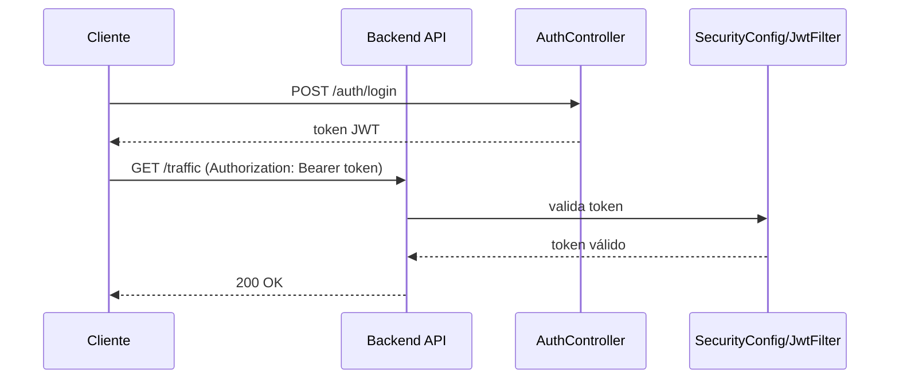

# API

Este documento descreve o contrato HTTP atual da branch `main`.

## Base URLs

### Backend Java

- Base: `http://localhost:8080`
- Swagger UI: `http://localhost:8080/swagger-ui/index.html`
- OpenAPI: `http://localhost:8080/v3/api-docs`

### Microservice Python

- Base: `http://localhost:8000`

## Autenticação e Controle de Acesso (Backend Java)

Conforme `SecurityConfig`, rotas públicas:

- `POST /auth/**`
- `GET /v3/api-docs/**`
- `GET /swagger-ui/**`
- `GET /swagger-ui.html`
- `GET /traffic/traffic-volume`
- `GET /traffic/traffic-volume-area`
- `GET /traffic/sptrans/posicao`

Rotas autenticadas (JWT Bearer):

- `GET|POST /traffic/**` (exceto as rotas públicas listadas acima)
- `GET|POST /api/**`
- `GET /insights`

Header esperado nas rotas autenticadas:

- `Authorization: Bearer <token>`

### Fluxo de Autenticação (JWT)



## Endpoints do Backend Java

### Autenticação (`/auth`)

- `POST /auth/register`
- `POST /auth/login`
- `POST /auth/google`

Observação importante:

- `GET /auth/verify` **não existe** no backend atual.

### Tráfego (`/traffic`)

- `POST /traffic/load`
- `GET /traffic`
- `POST /traffic`
- `GET /traffic/filter?clima=&nivel=&alerta=`
- `GET /traffic/insights`
- `GET /traffic/news?query=`
- `GET /traffic/dashboard?q=&clima=&nivel=`
- `GET /traffic/sptrans?endpoint=`
- `GET /traffic/sptrans/posicao`
- `GET /traffic/route?cidade=&origem=&destino=&modo=`
- `GET /traffic/traffic-volume?lat=&lon=`
- `GET /traffic/traffic-volume-area`

Comportamentos atuais relevantes:

- `GET /traffic/news` retorna mock (`news: []`).
- `GET /traffic/sptrans/posicao` possui fallback mock em caso de falha externa.
- `GET /traffic/route` hoje retorna resposta mock controlada.
- `GET /traffic/traffic-volume` tenta TomTom e aplica fallback estimado.
- `GET /traffic/traffic-volume-area` retorna mock no controller.

### Insights adicional

- `GET /insights`

### Transporte (`/api/transporte`)

- `GET /api/transporte/cidades`
- `GET /api/transporte/stops/{cidade}?limit=100&offset=0`
- `GET /api/transporte/routes/{cidade}?limit=50`
- `GET /api/transporte/stops/{cidade}/nearby?lat=&lon=&radius=1.0`
- `POST /api/transporte/calculate-route`

### GTFS Java (`/api/gtfs`)

- `GET /api/gtfs/cidades`
- `GET /api/gtfs/stops/{cidade}`
- `GET /api/gtfs/routes/{cidade}`
- `GET /api/gtfs/heatmap/{cidade}`

### Analytics Java (`/api/analytics`)

- `GET /api/analytics/crowd-flow`

### Clima Java (`/api/test/clima`)

- `GET /api/test/clima?lat=&lon=`
- `GET /api/test/clima/atual?lat=&lon=`

## Endpoints do Microservice Python

### GTFS (`/gtfs`)

- `GET /gtfs/cidades`
- `GET /gtfs/stops/{cidade}`
- `GET /gtfs/routes/{cidade}`
- `GET /gtfs/stops/nearby/{cidade}?lat=&lon=&raio_km=`
- `GET /gtfs/public-transit?origin_lat=&origin_lon=&destination_lat=&destination_lon=&cidade=`
- `GET /gtfs/bus-route?bus_line=&origin_lat=&origin_lon=&destination_lat=&destination_lon=&cidade=`
- `GET /gtfs/health`

### Analytics (`/analytics`)

- `GET /analytics/analise/{cidade}`
- `GET /analytics/analise/todas`
- `GET /analytics/heatmap/{cidade}?hora_inicio=&hora_fim=`

Observação importante:

- `GET /analytics/forecast` **não existe** no microservice atual.

## Divergências conhecidas com chamadas do frontend

No arquivo `SmartTrafficFlow/smartTrafficFlow/src/services/api.js` existem chamadas sem endpoint correspondente hoje:

- `GET /auth/verify`
- `POST /traffic/history`
- `GET /traffic/dashboard-complete`
- `GET /analytics/forecast`

## Roteiro rápido de teste para avaliador

1. Verificar saúde dos serviços:

```bash
curl http://localhost:8080/v3/api-docs
curl http://localhost:8000/
```

2. Criar usuário:

```bash
curl -X POST http://localhost:8080/auth/register \
  -H "Content-Type: application/json" \
  -d "{\"nome\":\"Avaliador\",\"email\":\"avaliador@example.com\",\"senha\":\"123456\"}"
```

3. Fazer login e copiar o token:

```bash
curl -X POST http://localhost:8080/auth/login \
  -H "Content-Type: application/json" \
  -d "{\"email\":\"avaliador@example.com\",\"senha\":\"123456\"}"
```

4. Testar rota autenticada:

```bash
curl http://localhost:8080/traffic \
  -H "Authorization: Bearer SEU_TOKEN"
```

5. Testar rota pública de volume:

```bash
curl "http://localhost:8080/traffic/traffic-volume?lat=-23.5505&lon=-46.6333"
```

6. Testar GTFS no microservice:

```bash
curl "http://localhost:8000/gtfs/public-transit?origin_lat=-23.55&origin_lon=-46.63&destination_lat=-23.56&destination_lon=-46.65&cidade=sao_paulo"
```
