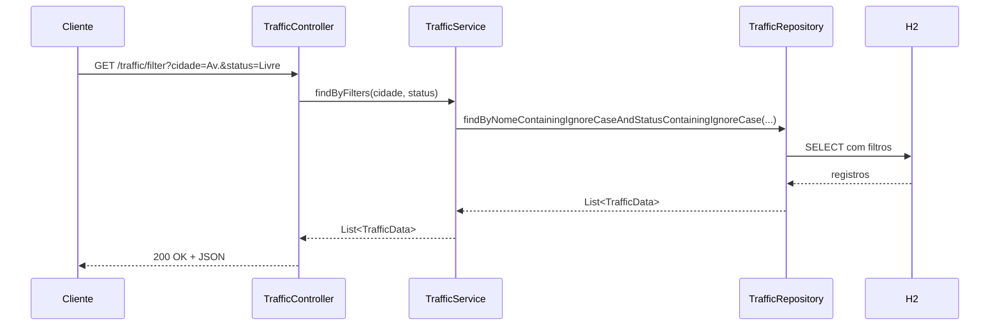
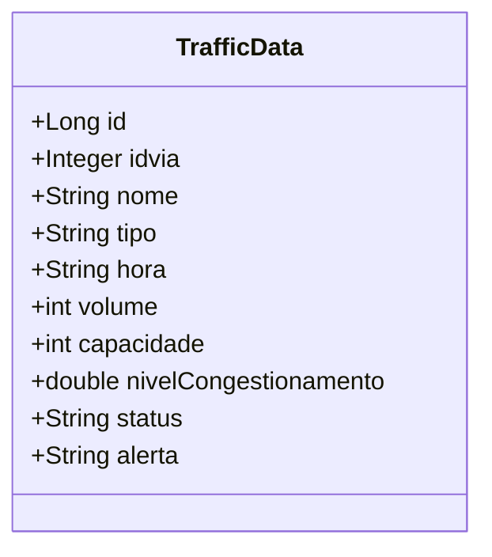

# API

Este documento concentra os endpoints, exemplos de uso, comportamento atual e observacoes de implementacao da API.

## Base URL

Ambiente local padrao:

- `http://localhost:8080`

Base path atual:

- `/traffic`

## Endpoints Disponiveis

### `GET /traffic`

Retorna todos os registros persistidos.

Exemplo:

```bash
curl http://localhost:8080/traffic
```

Resposta esperada:

```json
[
  {
    "id": 1,
    "idvia": 1,
    "nome": "Av. Central",
    "tipo": "Arterial",
    "hora": "08:00",
    "volume": 920,
    "capacidade": 1000,
    "nivelCongestionamento": 92.0,
    "status": "Critico",
    "alerta": "Via Saturada"
  }
]
```

### `GET /traffic/filter`

Filtra registros por nome da via e status.

Parametros opcionais:

- `cidade`
- `status`

Exemplo:

```bash
curl "http://localhost:8080/traffic/filter?cidade=Central&status=Critico"
```

Comportamento atual:

- se `cidade` nao for enviado, o filtro considera string vazia
- se `status` nao for enviado, o filtro considera string vazia
- o filtro usa busca parcial com `ContainingIgnoreCase`

### `POST /traffic`

Cria um novo registro manualmente.

Payload de exemplo:

```json
{
  "idvia": 1,
  "nome": "Av. Central",
  "tipo": "Arterial",
  "hora": "08:00",
  "volume": 920,
  "capacidade": 1000,
  "nivelCongestionamento": 92.0,
  "status": "Critico",
  "alerta": "Via Saturada"
}
```

Exemplo:

```bash
curl -X POST http://localhost:8080/traffic \
  -H "Content-Type: application/json" \
  -d '{"idvia":1,"nome":"Av. Central","tipo":"Arterial","hora":"08:00","volume":920,"capacidade":1000,"nivelCongestionamento":92.0,"status":"Critico","alerta":"Via Saturada"}'
```

Resposta atual:

- `201 Created`
- corpo com a entidade persistida

Observacao:

- ainda nao ha validacoes de entrada nem padronizacao de erros

### `POST /traffic/load`

Tenta carregar dados de um arquivo JSON e persisti-los evitando duplicidade por `idvia + hora`.

Fluxo implementado:

1. o controller chama `TrafficService.loadData()`
2. o service tenta ler `traffic_data.json` do classpath
3. cada item e salvo apenas se `existsByIdviaAndHora(...)` retornar falso

Estado atual:

- a implementacao existe
- o arquivo JSON exigido por esse fluxo ainda nao esta em `backend/src/main/resources`
- hoje a carga inicial operacional da aplicacao acontece via `import.sql`

## Fluxo de Consulta



## Modelo Atual da Entidade



## Melhorias Recomendadas

- adicionar DTOs de request e response
- incluir Bean Validation
- padronizar erros com `@ControllerAdvice`
- documentar a API com Swagger/OpenAPI
- adicionar paginacao e ordenacao nas consultas
