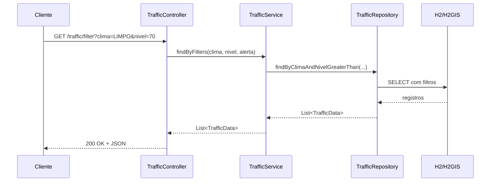
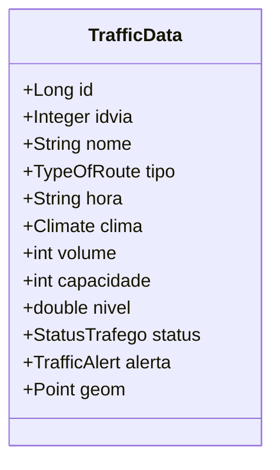

# API

Este documento concentra os endpoints, comportamento atual e contrato principal do backend.

## Base URL

Ambiente local padrão:

- `http://localhost:8080`

Base path atual:

- `/traffic`

## Endpoints Disponíveis

### `GET /traffic`

Retorna todos os registros persistidos.

Exemplo:

```bash
curl http://localhost:8080/traffic
```

### `GET /traffic/filter`

Filtra registros com base nos parâmetros atualmente suportados pelo backend.

Parâmetros opcionais:

- `clima`
- `nivel`
- `alerta`

Exemplos:

```bash
curl "http://localhost:8080/traffic/filter?clima=CHUVA_LEVE"
```

```bash
curl "http://localhost:8080/traffic/filter?nivel=70"
```

```bash
curl "http://localhost:8080/traffic/filter?alerta=CONGESTIONAMENTO_CRITICO"
```

Comportamento atual:

- se `clima` e `nivel` forem enviados juntos, o backend usa `findByClimaAndNivelGreaterThan(...)`
- se apenas `clima` for enviado, usa `findByClima(...)`
- se apenas `nivel` for enviado, usa `findByNivelGreaterThan(...)`
- se apenas `alerta` for enviado, usa `findByAlerta(...)`
- sem parâmetros, retorna todos os registros

### `POST /traffic`

Cria um novo registro manualmente.

Payload de exemplo:

```json
{
  "idvia": 1,
  "nome": "Av. Central",
  "tipo": "ARTERIAL",
  "hora": "08:00",
  "clima": "LIMPO",
  "volume": 920,
  "capacidade": 1000,
  "nivel": 92.0,
  "status": "CRITICO",
  "alerta": "CONGESTIONAMENTO_CRITICO"
}
```

Observações:

- o backend hoje trabalha com enums para `tipo`, `clima`, `status` e `alerta`
- a entidade persistida também possui `geom`, embora esse campo não apareça naturalmente no exemplo simples acima

### `POST /traffic/load`

Tenta carregar dados de um arquivo JSON e persistí-los evitando duplicidade por `idvia + hora`.

Fluxo implementado:

1. o controller chama `TrafficService.loadData()`
2. o service lê `traffic_data.json` do classpath em uma lista de `TrafficDataDTO`
3. cada DTO é convertido para `TrafficData`
4. `lat/lng` são convertidos em `Point`
5. o registro só é salvo se `existsByIdviaAndHora(...)` retornar falso

Estado atual:

- a implementação existe
- o arquivo JSON exigido por esse fluxo ainda não está em `backend/src/main/resources`
- na prática, a carga inicial operacional continua acontecendo via `import.sql`

## Fluxo de Consulta



## Modelo Atual da Entidade



## Dependências Relevantes do Backend

- Spring Boot Web
- Spring Data JPA
- H2
- Hibernate Spatial
- H2GIS

## Melhorias Recomendadas

- adicionar DTOs de response e não expor diretamente a entidade
- incluir Bean Validation nas entradas
- padronizar erros com `@ControllerAdvice`
- documentar a API com Swagger/OpenAPI
- alinhar definitivamente o contrato do JSON de carga com o modelo persistido

## Insights do MVP

### `GET /traffic/insights`

Retorna insights simples para o MVP com base nos registros persistidos.

Resposta atual:

- `totalRegistros`: quantidade total de registros persistidos
- `horarioPico`: hora com maior soma de volume
- `volumeHorarioPico`: soma de volume no horario de pico
- `viaMaisMovimentada`: via com maior media de volume
- `mediaVolumeViaMaisMovimentada`: media de volume da via mais movimentada

Exemplo:

```json
{
  "totalRegistros": 72,
  "horarioPico": "18:00",
  "volumeHorarioPico": 1919,
  "viaMaisMovimentada": "Rodovia do Aeroporto",
  "mediaVolumeViaMaisMovimentada": 568.46
}
```
