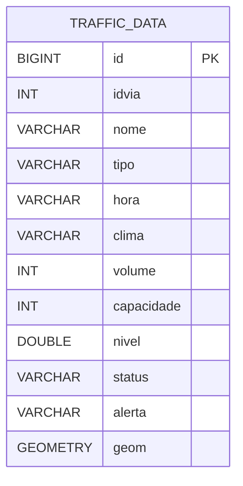
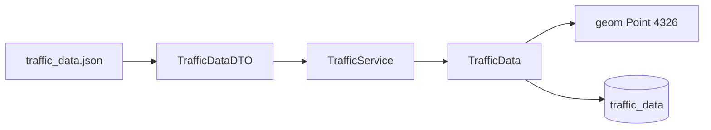

# Dados

Este documento resume a lógica de geração, os formatos de massa de dados e os pontos de atenção entre scripts auxiliares, DTOs e entidade persistida.

## Fontes de Dados no Projeto

Hoje o repositório possui duas frentes principais de dados:

- `backend/src/main/resources/import.sql`, usado no boot da aplicação para carga inicial da tabela `traffic_data`
- `traffic_data.json` na raiz, usado como base para scripts auxiliares, mas ainda não encaixado no classpath oficial do backend

Arquivos relacionados:

- `generator.py`
- `traffic_data.json`
- `backend/src/main/resources/import.sql`
- [TrafficDataDTO.java](../backend/src/main/java/br/com/smartTrafficFlow/Smart_Traffic_Flow/dto/TrafficDataDTO.java)

## Lógica de Simulação

O motor de simulação considera:

- picos comerciais em `08:00` e `18:00` para vias arteriais
- picos logísticos na madrugada e no fim da noite para a rodovia do aeroporto
- eventos aleatórios para simular incidentes ou anomalias operacionais

## Formato Atual do DTO de Carga

O backend hoje espera um contrato próximo deste em `TrafficDataDTO`:

| Campo | Tipo | Observação |
| :--- | :--- | :--- |
| `idvia` | `Integer` | identificador da via |
| `nome` | `String` | nome da via |
| `tipo` | `TypeOfRoute` | enum |
| `hora` | `String` | faixa horária |
| `clima` | `Climate` | enum |
| `volume` | `int` | volume medido |
| `capacidade` | `int` | capacidade da via |
| `nivel` | `double` | nível de ocupação |
| `status` | `StatusTrafego` | enum |
| `alerta` | `TrafficAlert` | enum |
| `lat` | `Double` | latitude para gerar `geom` |
| `lng` | `Double` | longitude para gerar `geom` |

## Modelo Persistido Pela API

## Pipeline Atual de Carga

## Divergências Atuais

Ainda existe uma lacuna entre a massa de dados da raiz e o contrato real esperado pelo backend:

- o JSON de apoio ainda não está dentro de `backend/src/main/resources`
- a documentação histórica usava campos como `id_via`, enquanto o backend trabalha com `idvia`
- o backend atual opera com enums e geometria, o que exige cuidado ao gerar ou importar dados

## Regras de Persistência

Já existe uma regra importante:

- restrição única em `idvia + hora`

Isso evita duplicidade lógica de medições para a mesma via no mesmo horário.

## Recomendações Para Evolução

- mover o JSON oficial de carga para `backend/src/main/resources`
- padronizar definitivamente os nomes de campos entre scripts, JSON e backend
- versionar o schema do dado de entrada
- criar validação explícita para importação antes de persistir
