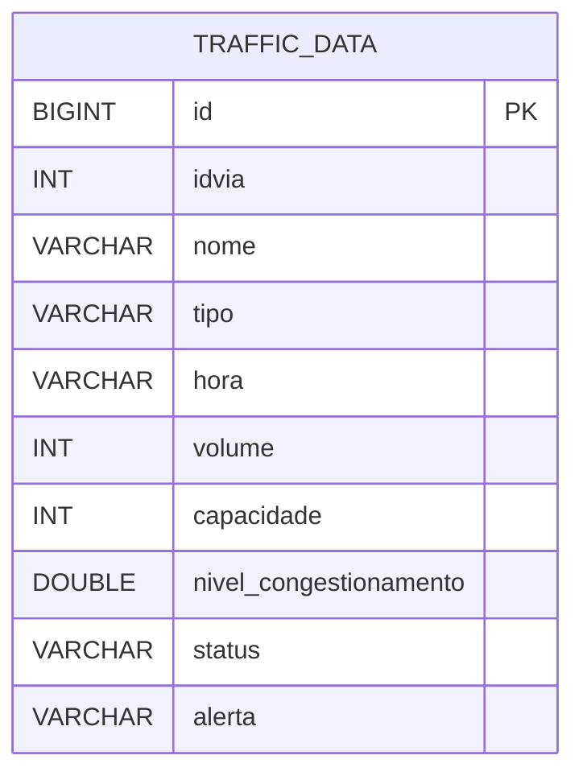

# Dados

Este documento resume a logica de geracao, os formatos de massa de dados e os pontos de atencao para integracao entre scripts auxiliares e a API.

## Fontes de Dados no Projeto

Hoje o repositorio possui duas frentes principais de dados:

- `import.sql`, usado pela API no boot para carga inicial da tabela `traffic_data`
- `traffic_data.json`, gerado por scripts auxiliares e ainda nao plugado de forma definitiva no classpath da aplicacao

Arquivos relacionados:

- `generator.py`
- `sql_generator.py`
- `train_ia.py`
- `traffic_data.json`
- `import.sql`

## Logica de Simulacao

O motor de simulacao considera:

- picos comerciais em `08:00` e `18:00` para vias arteriais
- picos logisticos na madrugada e no fim da noite para a rodovia do aeroporto
- eventos aleatorios para simular incidentes ou anomalias operacionais

## Formato Atual do JSON Gerado

O arquivo `traffic_data.json` da raiz segue majoritariamente esta estrutura:

| Campo | Descricao | Exemplo |
| :--- | :--- | :--- |
| `id_via` | Identificador da via | `1` |
| `nome` | Nome da via monitorada | `Av. Central` |
| `lat` | Latitude aproximada do ponto monitorado | `-23.5505` |
| `lng` | Longitude aproximada do ponto monitorado | `-46.6333` |
| `hora` | Faixa horaria da medicao | `14:00` |
| `clima` | Condicao climatica simulada | `Chuva Leve` |
| `volume` | Quantidade de veiculos detectados | `850` |
| `capacidade` | Capacidade estimada da via | `1000` |
| `nivel` | Percentual de ocupacao da via | `85.0` |
| `alerta` | Indicador textual de situacao | `Normal` |

## Modelo Persistido Pela API

A API atualmente persiste a entidade `TrafficData` com os seguintes campos:

## Divergencias Atuais Entre JSON e Entidade

Hoje existem diferencas que precisam ser tratadas antes de uma integracao definitiva:

- `id_via` no JSON versus `idvia` na entidade
- `nivel` no JSON versus `nivelCongestionamento` na entidade
- `lat`, `lng` e `clima` existem no JSON mas nao fazem parte da entidade persistida
- `tipo` e `status` existem na entidade e no SQL atual, mas nao aparecem de forma consistente no JSON exibido na raiz

## Regras de Alerta

O campo `alerta` pode ser usado no front-end para destacar ocorrencias:

1. `Normal`: fluxo dentro do esperado
2. `ANOMALIA`: comportamento fora do padrao esperado para aquele horario
3. `CONGESTIONAMENTO CRITICO`: via operando em faixa critica de ocupacao

## Regras de Persistencia

Ja existe uma regra importante na API:

- restricao unica em `idvia + hora`

Isso evita duplicidade logica de medicoes para a mesma via no mesmo horario.

## Recomendacoes Para Evolucao

- padronizar um contrato unico de dado entre scripts, JSON e entidade Java
- mover o JSON de carga oficial para `backend/src/main/resources`
- criar DTO ou mapeador explicito para importacao
- versionar o schema dos dados caso o motor de simulacao continue evoluindo
