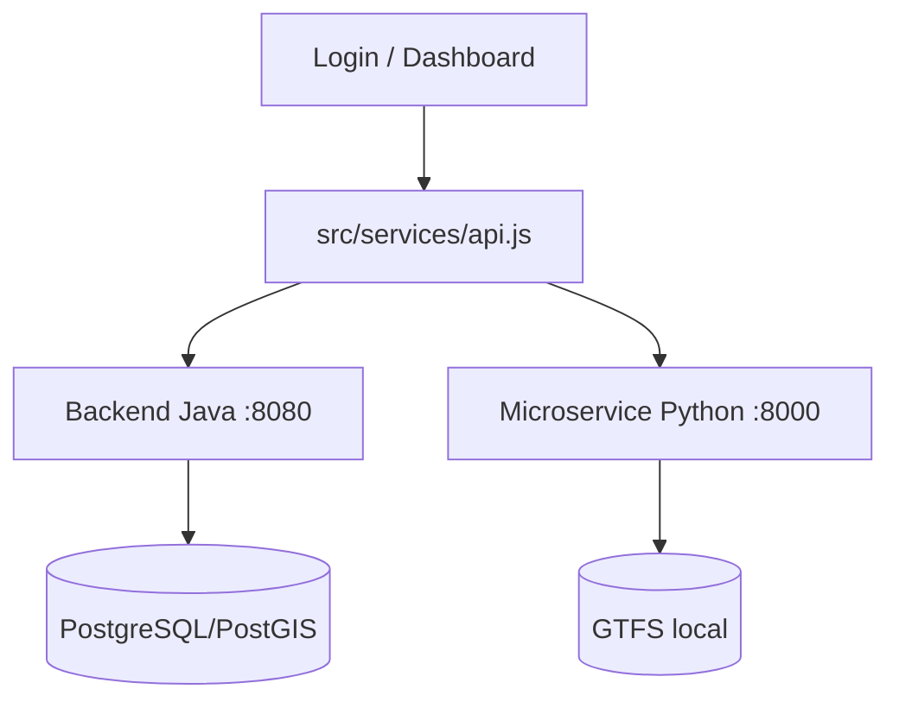

# Frontend

Este documento descreve o frontend ativo da branch `main`.

## Frontend Oficial da Entrega

Diretório:

- `SmartTrafficFlow/smartTrafficFlow`

Observação:

- A pasta `frontend/` antiga foi removida da `main`.

## Stack

- React 18
- Vite 8
- Tailwind CSS 4
- Axios
- React Router
- Recharts
- Leaflet / React-Leaflet / Leaflet Heat / Leaflet Routing Machine
- Lucide React

## Estrutura Principal

- `src/App.jsx`
- `src/context/AuthContext.jsx`
- `src/pages/Login/Login.jsx`
- `src/pages/Dashboard/Dashboard.jsx`
- `src/pages/Dashboard/DashboardMap.jsx`
- `src/services/api.js`

## Fluxo de Navegação

- `/login`
- `/dashboard` (rota protegida)
- `/` redireciona conforme autenticação

### Fluxo de Dados (Frontend)



## Integrações de API no Frontend

### Backend Java (`http://localhost:8080`)

- `POST /auth/login`
- `POST /auth/register`
- `GET /traffic/sptrans/posicao`
- `GET /traffic/route`
- `GET /traffic/traffic-volume`
- `GET /traffic/traffic-volume-area`
- `GET /traffic`
- `GET /api/analytics/crowd-flow` (via fetch)

### Microservice Python (`http://localhost:8000`)

- `GET /gtfs/public-transit`
- `GET /gtfs/stops/nearby/{cidade}`
- `GET /gtfs/routes/{cidade}`
- `GET /gtfs/bus-route`
- `GET /analytics/analise/{cidade}`

## APIs externas chamadas direto no frontend

- Nominatim (geocoding)
- Open-Meteo (clima)

## Funcionalidades Visíveis no Dashboard

- Busca de origem e destino por texto
- Geocoding de endereços
- Cálculo de rota com prioridade para GTFS (Python) e fallback Java
- Atualização periódica de posição de ônibus
- Mapa com rota, ônibus e heatmap
- Cards de telemetria (velocidade, clima, vento, congestionamento)
- Gráfico de volume de tráfego por origem/destino

## Divergências Conhecidas de Contrato

Chamadas presentes no frontend sem endpoint correspondente hoje:

- `GET /auth/verify` (backend Java)
- `POST /traffic/history` (backend Java)
- `GET /traffic/dashboard-complete` (backend Java)
- `GET /analytics/forecast` (microservice)

Essas chamadas não impedem o fluxo principal de demonstração, mas devem ser tratadas em ciclo posterior.

## Como Executar

No diretório `SmartTrafficFlow/smartTrafficFlow`:

```bash
npm install
npm run dev
```

URL local:

- `http://localhost:5173`
