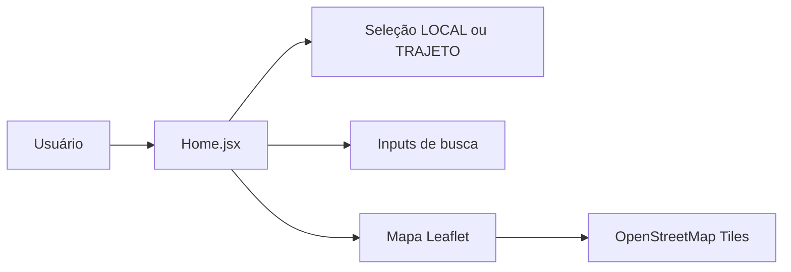

# Frontend

Este documento descreve o estado atual do frontend da aplicação.

## Stack

- React 19
- Vite 8
- ESLint

## Estrutura Relevante

Arquivos principais:

- [frontend/src/App.jsx](C:/NoCountry/SimulacaodeTrabalho/SmartTrafficFlow/S03-26-Equipe-26-Web-App-Development/frontend/src/App.jsx)
- [frontend/src/pages/home/Home.jsx](C:/NoCountry/SimulacaodeTrabalho/SmartTrafficFlow/S03-26-Equipe-26-Web-App-Development/frontend/src/pages/home/Home.jsx)
- [frontend/package.json](C:/NoCountry/SimulacaodeTrabalho/SmartTrafficFlow/S03-26-Equipe-26-Web-App-Development/frontend/package.json)

## Estado Atual da Interface

Hoje o frontend entrega:

- tela inicial com identidade visual do projeto
- alternância entre seleção por `LOCAL` e `TRAJETO`
- campos de entrada para localização e origem/destino
- renderização de mapa com Leaflet usando tiles do OpenStreetMap

## Fluxo Atual



## Observações Importantes

- o frontend atual ainda não mostra chamadas explícitas para a API do backend
- a dependência `leaflet` e seu CSS são importados em `Home.jsx`, mas não aparecem declarados em `frontend/package.json`
- o `frontend/README.md` ainda está no template padrão do Vite e pode ser atualizado depois, se o time quiser documentação interna por pasta

## Como Executar

No diretório `frontend`:

```bash
npm install
npm run dev
```

Endereço local padrão:

- `http://localhost:5173`

## Próximos Passos Recomendados

- declarar formalmente `leaflet` no `package.json`
- integrar o frontend com os endpoints do backend
- documentar rotas de tela, estados e componentes conforme a UI crescer
